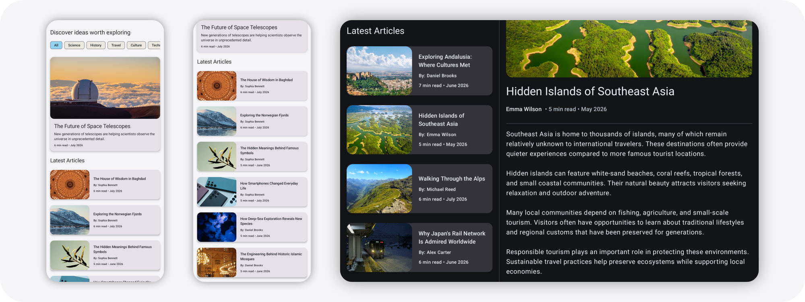

<div align="center">


# Horizon

A modern Android knowledge and discovery application built with Jetpack Compose.

Horizon presents carefully curated articles across Science, History, Travel, Culture, and Technology in a clean and adaptive reading experience.

</div>

## Screenshots

### Light Theme



### Dark Theme


## Features

* Adaptive layouts for phones and tablets
* Material 3 design
* Light and dark themes
* Category filtering
* Featured article experience
* Rich article reading screen
* Professional content and imagery
* Offline local content source
* ViewModel and UI testing
* Responsive reading experience

## Demo Videos

### Phone Demo

https://github.com/user-attachments/assets/c3bd38bf-7ba9-4e8b-b469-e408eaf303fb

### Tablet Demo

https://github.com/user-attachments/assets/c28c277c-2827-439c-87d0-b675f87e9a84

## Tech Stack

* Kotlin
* Jetpack Compose
* Material 3
* Navigation Compose
* ViewModel
* StateFlow
* Repository Pattern
* Adaptive Layouts
* JUnit
* Compose UI Testing

## Architecture

Horizon follows a layered architecture:

```text
UI Layer
    ↓
ViewModel Layer
    ↓
Repository Layer
```

State is managed using StateFlow and exposed to the UI through ViewModels.

## Inspiration

This project was built as a portfolio-focused learning project and was inspired by Google's JetNews sample application. The implementation, content catalog, branding, adaptive layouts, testing strategy, and overall user experience were redesigned and expanded as part of the learning process.

## Adaptive Layout

### Phone Layout

- List → Detail navigation
- Optimized for compact screens

### Tablet Layout

- Home and article content displayed side-by-side
- Uses an adaptive master-detail layout

## Testing

* HomeViewModel tests
* Repository tests
* Compose UI tests
* Navigation tests

## Release APK

A release build of the application (APK) is included in:

`release/Horizon-v1.0.apk`
